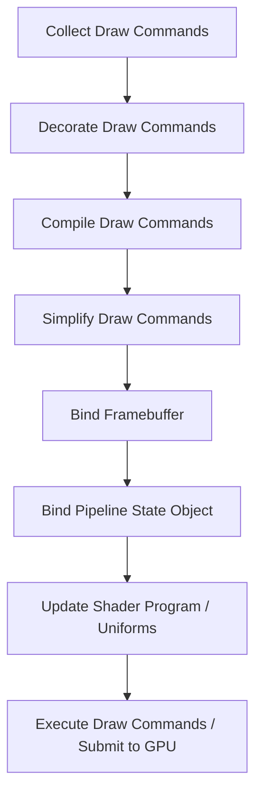
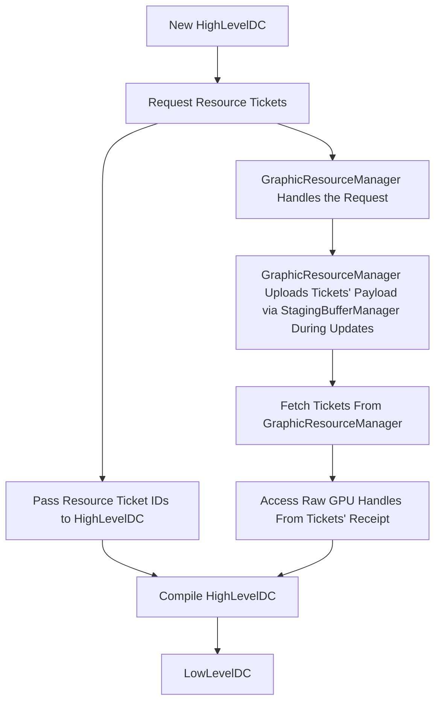

# Engine Overview

## 0. Introduction

Briefly describe the engine's design philosophy:
- Designed to be as independent of Minecraft as possible
- ECS & Data Oriented Technology Stack (much like Unity)
- Modern rendering architecture (GPU-driven geometry, meshlet, multi-draw indirect)
- CPU & GPU hybrid dual pipeline
- Semi-static diffuse global illumination with a final gather stage (may include RT)
- The primary goals are high performance, extensibility, and future-proof design

And the following is a walkthrough that guides you through the engine step by step.

***

**Table of Contents**
- 1 ECS Runtime & Kirino Engine Setup
  - 1.1 ECS Runtime Setup
  - 1.2 Kirino Engine Setup
- 2 Rendering Pipeline
  - 2.1 Pipeline State Object
  - 2.2 Framebuffer
  - 2.3 Render Pass & Subpass
  - 2.4 Draw Command
  - 2.5 Command Decoration
- 3 OpenGL Abstraction
  - 3.1 Resource Disposal
  - 3.2 Buffer Object
  - 3.3 Texture
  - 3.4 Shader
- 4 Chunk Meshlet & Virtual Geometry
- 5 Virtual Geometry & GPU Pipeline
- 6 Global Illumination
- 7 Hybrid & Final Gather
- 8 Tile Entity Renderer API

***

## 1. ECS Runtime & Kirino Engine Setup

`KirinoCore.init()` will be executed at the end of `FMLClientHandler.beginMinecraftLoading()`, which occurs at the end of the `preInit` phase.

During `KirinoCore.init()`, the following steps will be performed:
- Set up `KHR_debug`
- Register default event listeners to `KirinoCore.KIRINO_EVENT_BUS`
- Initialize the ECS Runtime
- Initialize the Kirino Engine

> Note: 
> - We pass `KirinoCore.KIRINO_EVENT_BUS` to the constructors of `CleanECSRuntime` & `KirinoEngine`, so all relevant events will be posted to `KirinoCore.KIRINO_EVENT_BUS`
> - Please use `KirinoCore.KIRINO_EVENT_BUS` instead of `MinecraftForge.EVENT_BUS` for your event listeners

Here's a list of events you can listen from ECS Runtime setup:
- `StructScanningEvent`
- `ComponentScanningEvent`
- `JobRegistrationEvent`

Here's a list of events you can listen from Kirino Engine setup:
- `ShaderRegistrationEvent`

### Example: How do I register shaders?
`shader.vert`
```glsl
#version 330 core

layout(location = 0) in vec3 position;
layout(location = 1) in vec4 color;

out vec4 Color;

uniform vec3 worldOffset;

uniform mat4 viewRot; // Minecraft doesn't use standard viewModel matrix
uniform mat4 projection;

void main(void)
{
    gl_Position = projection * viewRot * vec4(position - worldOffset, 1.0);
    Color = color;
}

```
```java
@SubscribeEvent
public static void onShaderRegister(ShaderRegistrationEvent event) {
    event.register(new ResourceLocation("namespace:your/shader.vert"));
}
```

> Note:
> - Please use shader suffix `vert`, `frag`, `geom`, `tesc`, `tese`, `comp`

## 1.1 ECS Runtime Setup

Let's look at an example first
```java
PositionComponent positionComponent = new PositionComponent();
positionComponent.xyz = new Vector3f(1, 2, 3);

// components will be flattened and stored in archetype data pools
// and entities are represented as data rather than objects
// -> reduce per entity object allocations and gc pressure
ECS_RUNTIME.entityManager.createEntity(positionComponent);
ECS_RUNTIME.entityManager.createEntity(positionComponent);
ECS_RUNTIME.entityManager.createEntity(positionComponent);

// the side effects are deferred. guarantees thread safety
ECS_RUNTIME.entityManager.flush();

// the query is archetype oriented not entity oriented. faster query
List<ArchetypeDataPool> archetypes = ECS_RUNTIME.entityManager.startQuery(ECS_RUNTIME.entityManager.newQuery().with(PositionComponent.class));
LOGGER.info("archetype num: " + archetypes.size()); // assert: 1

// the array is fetched from archetype data pools directly. zero copy
// providing a friendly structure to parallel jobs
IPrimitiveArray<?> array = archetypes.get(0).getArray(PositionComponent.class, "xyz", "z");
ArrayRange range = archetypes.get(0).getArrayRange();
for (int i = range.start; i < range.end; i++) {
    // skip deleted entities
    if (range.deprecatedIndexes.contains(i)) {
        continue;
    }
    LOGGER.info("debug: " + array.getFloat(i));
} // assert: 3.0 3.0 3.0
```

As you can see, ECS is a way to manage entities and execute jobs on them effectively.
We'll use ECS to manage render targets, like `Chunk`, `Meshlet`, `Probe`, etc.
Although raw chunk data can't be stored directly in ECS, ECS is still useful to manage the components that store metadata like `isDirty`, `pos`, `aabb` etc.

### ECS Job usage example
```java
public class ChunkMeshletGenJob implements IParallelJob {
    @JobExternalDataQuery
    public ChunkProviderClient chunkProvider;

    @JobDataQuery(componentClass = ChunkComponent.class, fieldAccessChain = {"chunkPosX"})
    public IPrimitiveArray chunkPosXArray;

    @JobDataQuery(componentClass = ChunkComponent.class, fieldAccessChain = {"chunkPosZ"})
    public IPrimitiveArray chunkPosZArray;

    @Override
    public void execute(int index) {
        int x = chunkPosXArray.getInt(index);
        int z = chunkPosZArray.getInt(index);
        KirinoCore.LOGGER.info("debug chunk xz: " + x + ", " + z);
    }

    @Override
    public void query(EntityQuery entityQuery) {
        entityQuery.with(ChunkComponent.class);
    }
}
```

### Example: How do I register ECS components?
```java
@CleanComponent
public class YourComponent implements ICleanComponent {
    public YourStruct a;
}

@CleanStruct
public class YourStruct {
    public int b;
}
```
```java
@SubscribeEvent
public static void onStructScan(StructScanningEvent event) {
    event.register("your.package.name");
}

@SubscribeEvent
public static void onComponentScan(ComponentScanningEvent event) {
    event.register("your.package.name");
}
```

> Note:
> - Available types `T` = {`int`, `float`, `boolean`, `org.joml.Vector2f`, `org.joml.Vector3f`, `org.joml.Vector4f`, `org.joml.Matrix3f`, `org.joml.Matrix4f`}
> - You can only use any of `T` or the structs you defined in a struct
> - Yan can only use any of `T` or the structs you defined in a component

## 1.2 Kirino Engine Setup

Kirino Engine contains:
- `RenderingCoordinator`
- More coordinators coming soon...

`RenderingCoordinator` contains:
- Framebuffers
- A resolution container that handles automated framebuffer resize
- An ECS world `MinecraftScene`
- `MinecraftCamera` which wraps Minecraft's `ActiveRenderInfo`
- `ShaderRegistry` and all shader-related stuff
- `StagingBufferManager` to centralize CPU-to-GPU data uploading & handle buffering
- `GraphicResourceManager` to manage resource tickets and their lifecycles (pure logic)
- `GizmosManager` for debug visuals
- A bunch of `RenderPass`es

### Engine's Lifecycle
`KirinoCore.updateAndRender()` is the only entry point of the Kirino Engine
```java
public static void updateAndRender(long finishTimeNano) {
    // KIRINO_ENGINE.renderingCoordinator.run*Pass
}
```

> Note: `KirinoCore.updateAndRender()` is a direct replacement of `EntityRenderer.renderWorld(float, long)`. Specifically, `anaglyph` logic is removed and all other functions remain the same.

## 2. Rendering Pipeline

`KIRINO_ENGINE.renderingCoordinator.run*Pass` runs render passes. A render pass is a container that contains several subpasses, and subpass is where we implement the true rendering logic.

The following pseudocode illustrates the concept
```java
RenderPass pass = new RenderPass("Main Pass");
pass.addSubpass("Opaque Pass", new OpaquePass(renderer, opaquePSO, framebuffer));
pass.addSubpass("Cutout Pass", new CutoutPass(renderer, cutoutPSO, framebuffer));
pass.addSubpass("Transparent Pass", new TransparentPass(renderer, transparentPSO, framebuffer));
pass.render(camera);
```

As you can see, each subpass (`OpaquePass`/`CutoutPass`/`TransparentPass`) defines both its rendering logic and its associated `PSO` (Pipeline State Object) and `FBO` (Framebuffer).

## 2.1 Pipeline State Object
A `PSO` can be seen as an immutable value type that contains multiple GL states like `depth`, `raster` etc. 
We introduce `PSO` to avoid `GL.turnOn* -> render -> GL.turnOff*`-ish operations. During each subpass, all GL states are fixed and immutable (i.e. `GL.enable*`/`GL.getInt*` will never be used by clients).

> Note:
> - `GL.getInt*` causes pipeline stall
> - `PSO` makes every states predicatable so we drop manual `GL.enable*`/`GL.getInt*`

## 2.2 Framebuffer
A framebuffer, also known as a render target, is the target of a subpass.
Multi-resolution support is enforced here to facilitate future upgrades.

It's not recommended to instantiate framebuffers and use them on your own.

## 2.3 Render Pass & Subpass
`RenderPass` is a container that doesn't handle any of the rendering logic or implementations but stores `Subpass`es in an order.

```java
public class RenderPass {
    public void render() {
        for (Subpass subpass : subpasses) {
            subpass.collectCommands(drawQueue);
            subpass.decorateCommands(drawQueue, decorator);
            subpass.render(drawQueue);
        }
    }
}
```

As you can see, `RenderPass` acts like an entry point and we implement abstract `Subpass` classes to handle the true rendering logic.

### `Subpass.render()` Procedure


## 2.4 Draw Command
`DrawCommand` is an element of `DrawQueue`, and `Subpass` accepts a `DrawQueue` as the input.

There are only two types of `DrawCommand`:
- `HighLevelDC`
- `LowLevelDC`

### `HighLevelDC`-to-`LowLevelDC` Procedure


And `LowLevelDC` stores the raw GPU handles that we use directly in raw GL draw calls.

Usually, we do the following in a `Subpass` implementation.
```java
@Override
public void collectCommands(DrawQueue drawQueue) {
    drawQueue.enqueue(gizmosManager.getDrawCommand());
}
```
This is where ticket request take place.

To be more specific about ticket request.
```java
graphicResourceManager.requestMeshTicket("my_mesh").ifPresent(builder -> {
    build(builder);
    graphicResourceManager.submitMeshTicket(builder);
});

return HighLevelDC.passInternal()
    .meshTicketID("my_mesh")
    .mode(GL11.GL_TRIANGLES)
    .elementType(GL11.GL_UNSIGNED_INT)
    .build();
```
We don't care if a ticket's payload is already uploaded (because uploading is usually a async process) OR a ticket is expired.
Every ticket's _status_ will be read carefully during the `HighLevelDC` compilation stage, which is during `Subpass.render()`, and bad tickets will be ignored.
Therefore, there is a delay between generating the real `LowLevelDC`s and submitting the ticket requests (usually an one frame delay).

Our design philosophy of `HighLevelDC` here is:
- Independent of raw GPU handles (`vao`, `ebo`, etc.)
- Independent of resource uploading (`glSubData` etc.)
- Independent of resource lifecycle (is it `cpu only` OR `gpu ready` OR `to be destroyed` ???)
- Just tell what you want to draw, like a simple keyword `my_mesh`

## 2.5 Command Decoration


## 3. OpenGL Abstraction
**Goal and Philosophy**: a semantic abstraction layer that preserves the meaning of GL operations instead of a black-box GL wrapper.

### Example: Buffer
For exmaple, we adopt a buffer-view pattern for managing buffers/textures. We use the untyped GL buffer container `GLBuffer` and views like `VBOView`.

```java
public class VBOView extends BufferView {
    public VBOView(GLBuffer buffer) {
        super(buffer);
    }

    @Override
    public int target() {
        return GL15.GL_ARRAY_BUFFER;
    }

    @Override
    public int bindingTarget() {
        return GL15.GL_ARRAY_BUFFER_BINDING;
    }
}
```

As a result, we can use arbitrary many views to wrap a buffer/texture to modify them.
Moreover, we provide high-level mapping utilities like `RenderObj2BufMorphism`, `Buf2DrawMorphism` etc. to manage data without touching indexes, 
which can be seen as a replacement to Minecraft's `BufferBuilder`.

### Example: Attribute Layout
```java
public static final AttributeLayout BLOCK_ATTRIBUTE_LAYOUT = new AttributeLayout();
static {
    BLOCK_ATTRIBUTE_LAYOUT.push(new Stride(28)
            .push(new Slot(Type.FLOAT, 3))
            .push(new Slot(Type.UNSIGNED_BYTE, 4).setNormalize(true))
            .push(new Slot(Type.FLOAT, 2))
            .push(new Slot(Type.SHORT, 2)));
}
```

When it comes to Vertex Attribute Layout, our abstraction aligns semantically with GL, allowing all possibilities.

## 3.1 Resource Disposal
All disposable GL resources will be added to `GLResourceManager` automatically by calling their `ctor`.
`GLResourceManager.disposeAll()` occurs at the end of the game, right before window destroy.

## 3.2 Buffer Object

## 3.3 Texture

## 3.4 Shader
