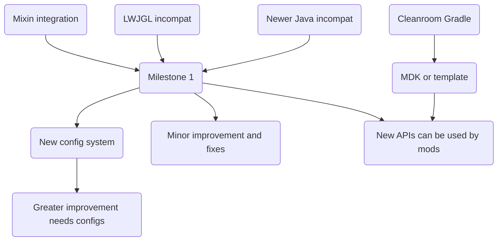

# Cleanroom Minecraft

### Components:

- Minecraft Coder Pack
- CleanroomLoader (Continuation + Revamp of ForgeModLoader)
- Cleanroom Minecraft (Continuation + Revamp of MinecraftForge)
- Mixin [(Coming Soon)](https://github.com/CleanroomMC/Mixin)
- Bytecode Patcher (Coming Soon) \[Inspired by [Bansoukou](https://github.com/LoliKingdom/Bansoukou) and [Bytecode Patcher](https://github.com/jbredwards/Bytecode-Patcher)]

### Build Instructions:

1. Clone this repository
2. Import the `build.gradle` into your IDE (most preferably IntelliJ IDEA)
3. Once the import has finished, run `gradlew setup`
4. Build with `gradlew build`

### Roadmap flow chart

