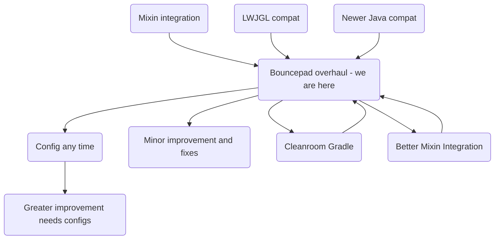

# Cleanroom Minecraft

## Features
### Implemented

- 1.12.2 on Java 21
- LWJGL3
- A working *mod development template/kit*
- Patches for loading incompatible mods
- Built-in Mixin w/ handy bootstrapping
- Develop using Scala 3 + Kotlin 2
- Compatibility to 99% of Forge mods

### Planning

- CleanroomGradle to replace ForgeGradle
- Classfile API
- Actually useful APIs (See [here](https://github.com/orgs/CleanroomMC/projects/4/))
- Optimized

## Components:

- Minecraft Coder Pack
- CleanroomLoader (Continuation + Revamp of ForgeModLoader)
- Cleanroom Minecraft (Continuation + Revamp of MinecraftForge)
- Customized Mixin
- Bytecode Patcher (Coming Soon) \[Inspired by [Bansoukou](https://github.com/LoliKingdom/Bansoukou) and [Bytecode Patcher](https://github.com/jbredwards/Bytecode-Patcher)]
- [Fugue](https://github.com/CleanroomMC/Fugue), a mod patches many incompatibilities.
- Javassist
- [Scalar](https://github.com/CleanroomMC/Scalar/releases/tag/2.11.1), a Scala provider. We made Scala libraries become a standalone mod so it can be updated.

## Download & Installation:

- For MultiMC-based launchers (PolyMC, PrismLauncher), download the MMC instance from [release](https://github.com/CleanroomMC/Cleanroom/releases), import it in your launcher(alternatively unzip patches and json inside to your 1.12 instance).
- For regular launcher (official launcher, AT launcher, FTB, HMCL), download the installer jar from release. You could use the installer like the Forge one.
- **Remember to install Fugue!**
- **And Scalar!**

## Build Instructions:

1. Clone this repository
2. Import the `build.gradle` into your IDE (most preferably IntelliJ IDEA)
3. Once the import has finished, run `gradlew setup`
4. Build with `gradlew build`

## Development Tips:

- Only modify `projects/cleanroom/src/` directory if you want to change vanilla
- Run `gradlew genPatches` before commit, or the changes won't exist
- Modifications on `src/` doesn't need generating patches
- [Tips from Forge](https://github.com/MinecraftForge/MinecraftForge/wiki/If-you-want-to-contribute-to-Forge) are still apply, keep the patches clean!
- The current patches is full of useless hunks after we switched to VineFlower, we encourage contributors to manual clean up their patches

## Mod Development:

There's an unofficial [template](https://github.com/kappa-maintainer/ExampleMod-1.12.2-FG5) exist. Note: You need to build before run.

A porting guide is available in [Cleanroom wiki](https://cleanroommc.com/wiki/cleanroom-mod-development/introduction).

## Roadmap flow chart

